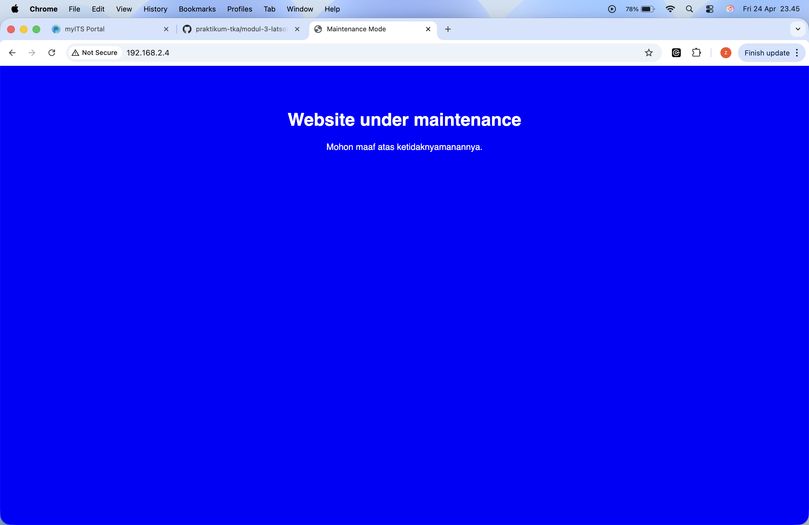

# Running latsol modul 3

## 1. persiapan infrastruktur (multipass & ssh)
```
# Buat VM baru khusus latsol
multipass launch --name maintenance-host --cpus 1 --memory 512M --disk 5G 22.04

# Cek IP VM (catat buat di inventory.yml nanti)
multipass list

# Injeksi SSH Key Mac ke VM (biar bisa remote tanpa password)
# Ganti 'isi_id_rsa.pub_kamu' dengan hasil 'cat ~/.ssh/id_rsa.pub'
multipass exec maintenance-host -- bash -c "mkdir -p /home/ubuntu/.ssh && echo 'isi_id_rsa.pub_kamu' >> /home/ubuntu/.ssh/authorized_keys && chmod 700 /home/ubuntu/.ssh && chmod 600 /home/ubuntu/.ssh/authorized_keys"
```

## 2. inisialisasi struktur ansible
```
# Buat folder roles secara otomatis
ansible-galaxy init roles/docker
ansible-galaxy init roles/maintenance

# Install koleksi Docker (wajib agar modul community.docker jalan)
ansible-galaxy collection install community.docker

# cek struktur folder biar yakin nggak ada yang ketinggalan
tree roles
```

## 3. eksekusi playbook
```
#jalankan instalasi docker dan deploy maintenance
ansible-playbook deploy.yml
```

## 4. verifikasi
```
# cek apakah file index.html sudah terbuat dan isinya benar (blue)
ansible maintenance_servers -m shell -a "cat /var/www/html/index.html"

# cek apakah kontainer Nginx sudah running (wajib pakai -b/sudo)
ansible maintenance_servers -b -m shell -a "docker ps"

# ambil IP buat dibuka di Chrome/Safari
multipass info maintenance-host | grep IPv4
```

## 5. cek website
buka sesuai IP maintenance-host di browser, jika sudah biru maka berhasil
